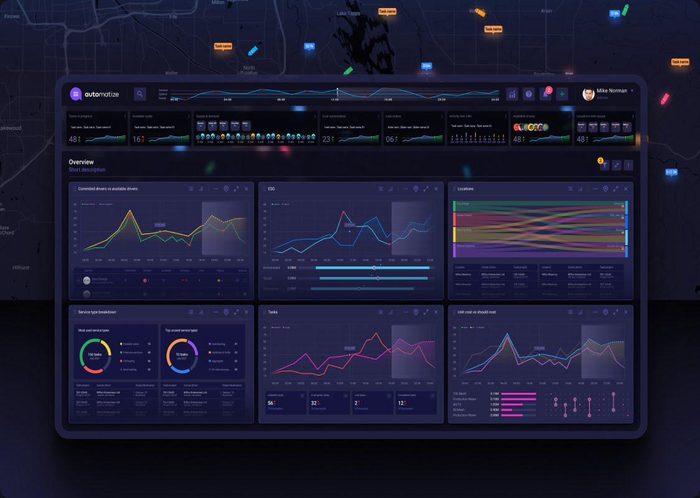
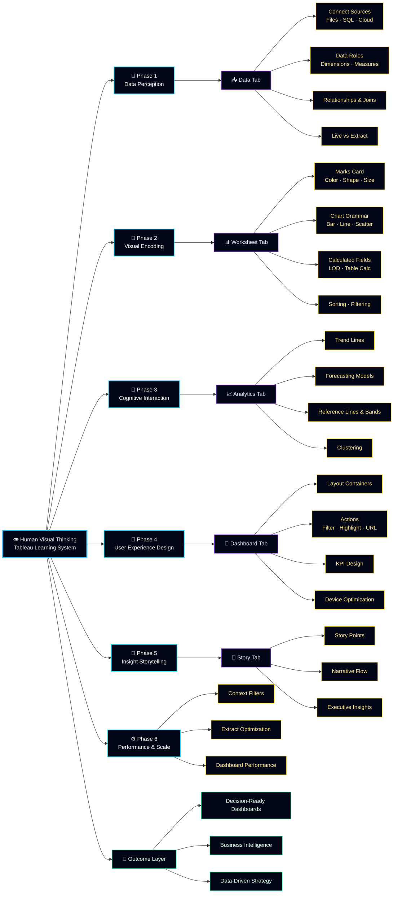

<!-- ===================== REPOSITORY METRICS ===================== -->

  
  
  
  
  

---

# 📊 Tableau Notes – Dashboard, KPIs & Business Intelligence  
### *Visual Analytics • UI/UX Dashboards • Insightful Storytelling*

---

## 🖼️ Visual Dashboard Gallery (UI/UX Matrix)

<table>
  <tr>
    <td align="center">
       
      <b>Interactive Dashboard Layout</b>
    </td>
    <td align="center">
       
      <b>Modern Dashboard UI</b>
    </td>
    <td align="center">
       
      <b>KPI-Driven Analytics</b>
    </td>
  </tr>
  <tr>
    <td align="center">
       
      <b>Business Intelligence View</b>
    </td>
    <td align="center">
       
      <b>UX-Focused Dashboard Design</b>
    </td>
    <td align="center">
       
      <b>Tableau Platform Overview</b>
    </td>
  </tr>
</table>

---

## 📌 Introduction
This repository is a **comprehensive Tableau Notes & Dashboard Design knowledge base**, focused on **visual analytics, KPI-driven insights, and business intelligence storytelling**.  
It is designed to help learners and professionals understand **how data transforms into decisions through effective dashboards**.

---

## 🎯 Objective of This Repository
- Build **strong Tableau fundamentals** with real dashboard visuals  
- Understand **UI/UX principles for analytics dashboards**  
- Learn **KPI design, layout structuring, and insight extraction**  
- Bridge the gap between **raw data and executive decision-making**

---

## 🔍 Analysis of Notes
The notes are structured to explain:
- 📥 **Data understanding & preparation**
- 📊 **Worksheet-level visual encoding**
- 🧩 **Dashboard composition & interactivity**
- 🎯 **KPI selection and performance tracking**
- 📖 **Storytelling with data**

Each section focuses on **why a visualization is used**, not just **how**.

---

## 💡 Key Insights from the Notes
- Effective dashboards prioritize **clarity over complexity**
- KPIs must align with **business goals**, not just metrics
- UI/UX design directly impacts **user cognition and decision speed**
- Storytelling converts dashboards into **actionable narratives**

---

## 🌟 Benefits of These Notes
- ✅ Beginner-friendly yet **industry-aligned**
- ✅ Strong focus on **real-world dashboards**
- ✅ Improves **analytical thinking and visualization logic**
- ✅ Useful for **students, analysts, and educators**

---

## 🚀 Importance of These Notes
In modern analytics roles, tools alone are not enough.  
These notes help you:
- Think like a **BI professional**
- Design dashboards that **communicate insights instantly**
- Build portfolios that **stand out visually and conceptually**

---

## 🧠 Summary
This Tableau Notes repository is not just documentation—it is a **visual learning system**.  
It emphasizes **design thinking, analytics logic, and storytelling**, enabling learners to create **decision-ready dashboards** with confidence.

---

---
## 🌐 Connect With Me

  
  

---
